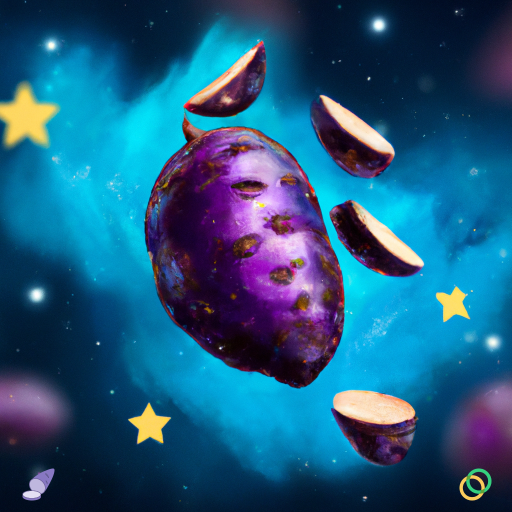

#  UBESWAP THEMED NFTS - NFT ART SERIES

Join us in a space yam to celebrate the path to a destiny of full community control with Ubeswap Celo DEX!
A biopunk and organic Ubeswap themed NFT collection of sliced solar ubes and asteroids in outer space.

[Ariswap NFT collection link](https://ariswap.co/collection-details/NjNhMDgxMDBlNDMzM2EwZDcwZjVjYWM4)

Made with love for the Ubeswap Destiny Hackathon sponsored by [Ubeswap](https://ubeswap.org) and [Celo](https://celo.org) hosted by [buidlbox](https://buidlbox.io/) and powered by [Gitcoin](https://gitcoin.co).

Available on Ariswap NFT Marketplace [can't wait to buy one](https://ariswap.co/collection-details/NjNhMDgxMDBlNDMzM2EwZDcwZjVjYWM4)

Please feel free to contact me at discord: ivanmolto#3768

## Ube Spaceship
An ube in the shape of a spaceship with sliced solar ubes around in a dark cyan galaxy with yellow stars in the background.

---

## Spatial DJ Ube
A DJ ube on top of a set of planet rings in a dark cyan galaxy.

---

## Ube & Frens in the space
Sliced solar ubes around a huge ube in a dark cyan galaxy with yellow stars in the background.

---

## Houston We have a Green Tail Ube
A green tail ube in a path to a decentralised control in a dark cyan galaxy.

---

## Mutant Ube Swap Club
A mutant ube clubbing with sliced solar ubes swapping around a dark cyan galaxy.

---

## Ube with Sliced Ube Pairs
A space ube with sliced solar ube pairs in a liquid cyan galaxy.

---

## Ube in a Solar Storm
A space ube with sliced ubes within a solar storm in a galaxy.

---

## Ube with a Community of Sliced Solar Ubes
Space ube with a community of sliced solar ubes in a path to decentralisation in the galaxy.

---

## Resilient Ube
A powerful and resilient ube with sliced solar ubes around it in a dark cyan galaxy.

---

## A Whale Ube
A whale ube standing in the outer space with sliced solar ubes around it in a regen galaxy with green stars.

---

## Ube ready community star genesis
The genesis of decentralization is near and this space ube knows it.

---

## Solar Irradiant Ube
A solar irradiant ube with solar ubes sliced in half in a dark cyan galaxy with white stars.

---

